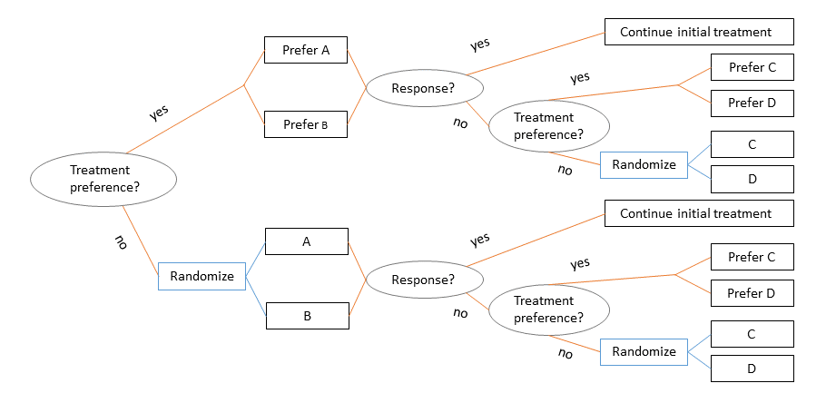
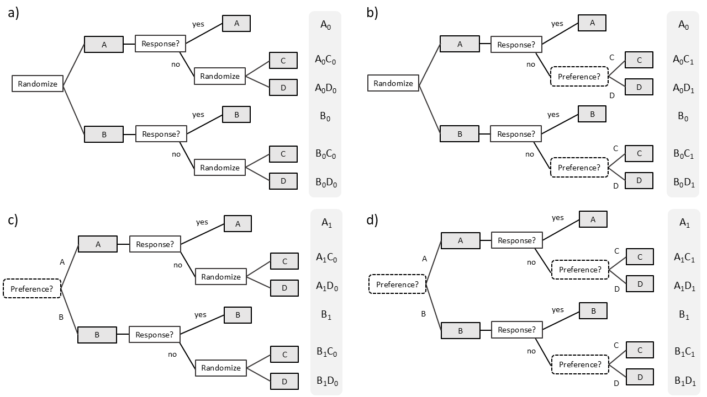

# PRPP_SMART_BHM
Bayesian hierarchical modeling methods to estimate DTRs in a Partially Randomized, Patient Preference, Sequential, Multiple Assignment, Randomized Trial with a continous end-of-trial outcome. Companion to the manuscript "Bayesian Dynamic Borrowing Approaches for Incorporating Patient Treatment Preferences in SMART Designs" by Sarah Medley, Satrajit Roychoudhury, Thomas M. Braun, and Kelley M. Kidwell. 

## The PRPP-SMART Design
Our PRPP-SMART design assumes there are two stages with two treatment options per stage. At the beginning of stage 1, participants are asked if they have a preference between the two stage 1 treament options (A, B). All participants with a preference are assigned to their preferred treatment while all others are randomized to one of the two treatment options. At the end of stage 1, response status is determined (i.e., responder or non-responder). Responders continue their stage 1 treatment in stage 2 while non-responders are re-assigned to two new treatment options that may be more effective (C, D). Treatment preference is elicited from non-responders at the beginning of stage 2, and non-responders with a preference receive their preferred treatment while all other non-responders are randomized. 

PRPP-SMARTs are an alternative to standard SMART designs when strong patient preferences may hinder trial recruitment or retention. PRPP-SMARTs can be visualized as a collection of 4 two-stage sub-trials, one of which is a standard SMART design (panel a).

Like a standard SMART design, there are 6 *treatment sequences* a participant in the PRPP-SMART may receive: A, AC, AD, B, BC, and BD. A and B correspond to treatment sequences for stage 1 responders while AC, AD, BC, and BC correspond to treatment sequences for stage 1 non-responders. When we incorporate treatment preference into the sequence, there are 20 total *trial pathways* which are denoted in the gray columns of the figure above (notation explained below). 

## PRPP-SMART Notation and Goal
Notation:
- A1 = {A, B} and A2 = {C, D} denote stage 1 and 2 treatment, respectively
- T1 and T2 are binary indicators of stage 1 and 2 treatment, respectively with T1 = 1 for A and 0 for B, T2 = 1 for C and 0 for D
- P1 and P2 are binary indicators of stage 1 and 2 preference, respectively

We denote trial pathways by A1P1 for responders and A1P1A2P2 for non-responders. We observe participant data at the trial pathway level in a PRPP-SMART, but our interest is in estimating *dynamic treatment regimens (DTRs)* which average over responder and non-responder pathways. We denote DTRs by [A1A1A2]P1P2, and there are 16 DTRs subject to treatment preference embedded in our PRPP-SMART design (i.e., the 4 traditional DTRs AAC, AAD, BBC, and BBD but within each preference combination). In particular, we aim to estimate the four *indifference DTRs* [AAC]00, [AAD]00, [BBC]00, and [BBD]00 with minimal bias while utilizing all data from a PRPP-SMART (i.e., borrowing data from individuals with treatment preferences). Since the use of non-randomized data makes bias a primary concern, we evaluate our method in a variety of scenarios. 

We previously developed frequentist weighted and replicated regression method (WRRM) to estimate PRPP-SMART DTRs (with code in my repository [PRPP_SMART_WRRM_continuous](https://github.com/snmedley/PRPP_SMART_WRRM_continuous/tree/main)). However, this method conduct a fixed level of borrowing (i.e., the amount of data borrowing does not depend on the observed data) and incur bias in settings of moderate to large differences in expected outcomes between PRPP-SMART participants. Here, we present 3 Bayesian hierarchical modeling (BHM) methods to estimate PRPP-SMART DTRs which conduct dynamic borrowing. In the companion manuscript, we demonstrate that our BHM methods significantly reduce bias compared to WRRM in scenarios with moderate to large differences in expected outcomes. 

## Data Generation and Simulation Scenarios
Code to generate PRPP-SMART data with a continuous stage 2 outcome can be found in my repository [PRPP_SMART_WRRM_continuous](https://github.com/snmedley/PRPP_SMART_WRRM_continuous/tree/main).

Across simulation scenarios, we vary preference rates (proportions of preference vs. no preference at stages 1 and 2), response rates (probability of response to A and B at the end of stage 1), and the distribution of the final outcome across trial pathways. We fix the expected outcome for the indifference DTRs across trial pathways but vary the expected outcome in the preference DTRs to generate different *preference augmented DTR effect types*. The different simulation scenarios are described in the tables below. RData files containing the parameter values for different simulation scenarios can be found in the folder Scenarios. 

| Preference/Response Rate Scenario | Probability of Stage 1 Preference | Probability of Stage 2 Preference | Probability of Response to A | Probability of Response to B |
| ------------------------------------ | --------------------------------- | --------------------------------- | ---------------------------- | ---------------------------- |
|                  a                   |                 0.5               |                  0.5              |               0.6            |              0.4             |
|                  b                   |                 0.5               |                  2/3              |               0.6            |              0.4             |
|                  c                   |                 2/3               |                  2/3              |               0.6            |              0.4             |
|                  a'                  |                 0.5               |                  0.5              |               0.5            |              0.5             |
|                  b'                  |                 0.5               |                  2/3              |               0.5            |              0.5             |
|                  c'                  |                 2/3               |                  2/3              |               0.5            |              0.5             |

| Preference Augmented DTR Effect Type |          Description         |
| ------------------------------------ | ---------------------------- |
|                  1                   | Additive effects of treatment preference. Main effects of P1 and P2 only. |
|                  2                   | Additive effects of treatment preference. Main effects of P1 and P2 and interaction effect (P1P2). |
|                  3                   | Additive effects of treatment preference. Main effects of P1 and P2 and interactions with treatment (P1T1 and P2T2) |
|                  4                   | Multiplicative effects of treatment preference. Our methods assume additive effects and we wanted to test performance when this assumption is violated. |

## Required Software
JAGS

## Analytic Methods

Description

Input:

Output:
